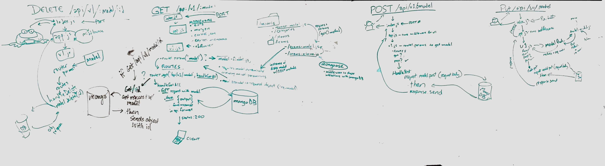
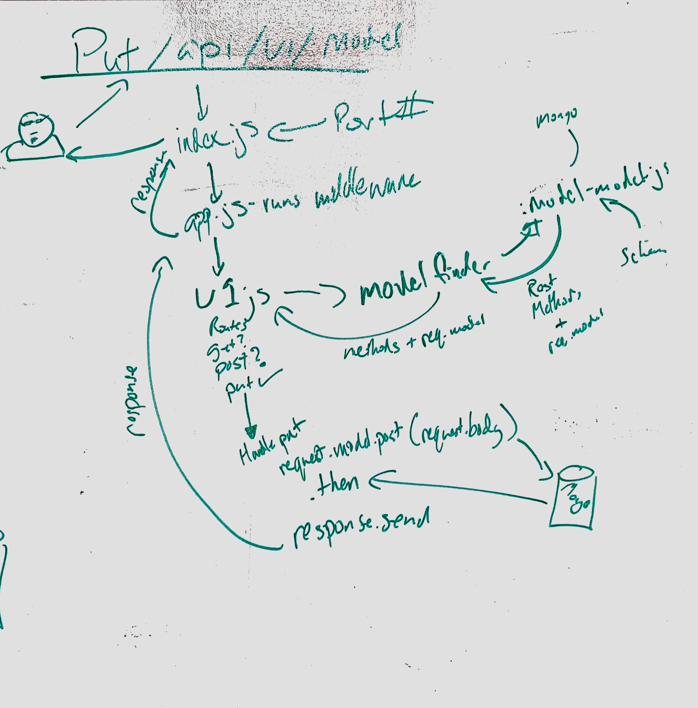
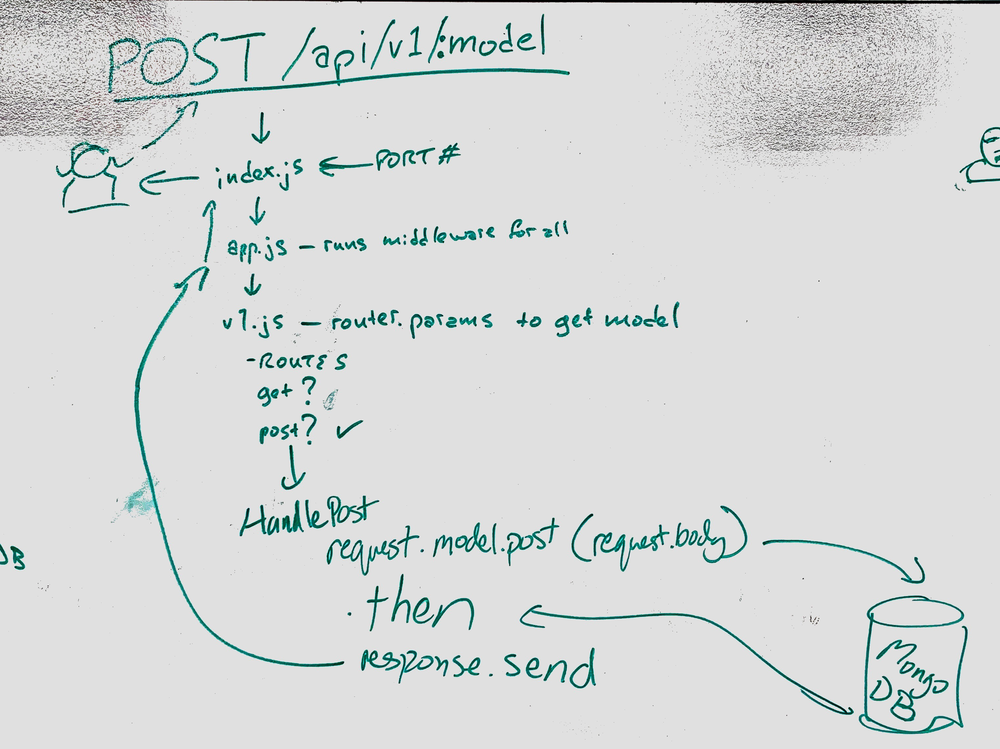
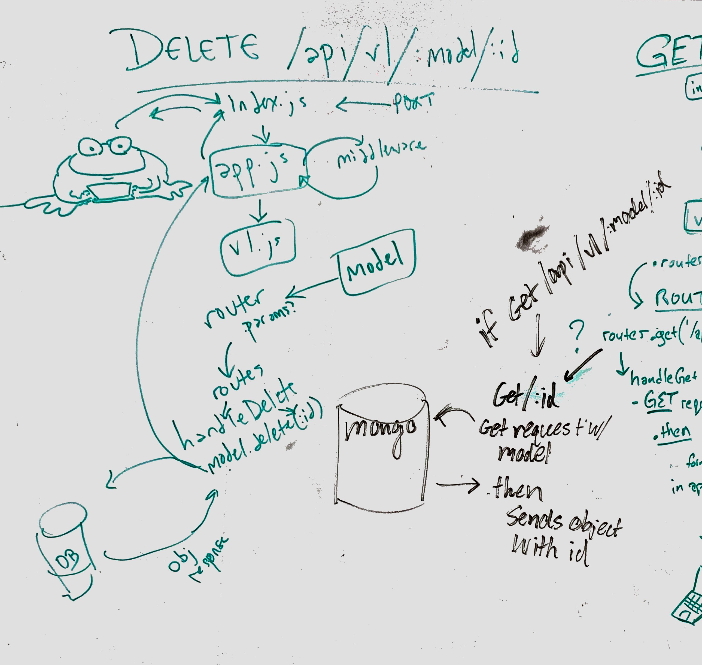

 LAB 09
=================================================

## API Server

### Author: Student/Group Name

### Links and Resources
* [pull request](https://github.com/codefellows-js-401d29-aaron-ferris/lab09/pull/2)
* [travis](https://travis-ci.com/codefellows-js-401d29-aaron-ferris/lab09)
* [back-end](http://xyz.com) (when applicable)

#### Documentation
* [swagger](http://xyz.com) The link isn't working yet. Need to smooth out mongo issues
* [jsdoc](http://xyz.com) The link isn't working yet. Need to smooth out mongo issues and whatever else is getting in the way.

###  Modules
#### `index.js`
Starts the inital setup and gives mongoose options
##### Exported Values and Methods
###### mongoose.connect
akes in the mongo uri the port and the mongoose options

#### `app.js`
##### Exported Values and Methods

###### `start(port) -> console.log `
starts up a server on the port given, and listens for request

###### Exports
App: everythign compiled in express, 
Start: the initialization and where it listens

#### `v1.js`
##### Exported Values and Methods

###### `handleGetAll`
 * @example router.get('/api/v1/:model', handleGetAll);
 * @param req {object} Express Request Object (required params: model)
 * @param res {object} Express Response Object
 * @param next {function} Express middleware next()

###### `handleGetOne`
 * Fetches a single record from a given model.
 * @example router.get('/api/v1/:model/:id', handleGetOne);
 * @param req {object} Express Request Object (required params: model, id)
 * @param res {object} Express Response Object
 * @param next {function} Express middleware next()

###### `handlePost`
 * @example router.post('/api/v1/:model', handlePost);
 * @param req {object} Express Request Object (required params: req.model)
 * @param res {object} Express Response Object
 * @param next {function} Express middleware next()

###### `handlePut`
* @example router.put('/api/v1/:model/:id', handlePut);
 * @param req {object} Express Request Object (required params: model, id)
 * @param res {object} Express Response Object
 * @param next {function} Express middleware next()

###### `handleDelete`
* @example router.delete('/api/v1/:model/:id', handleDelete);
 * @param req {object} Express Request Object (required params: model, id)
 * @param res {object} Express Response Object
 * @param next {function} Express middleware next()

 ###### Export: router
 * contains all of the handler functions

#### `404.js`
Middleware
##### Exported Values and Methods
Exports an error Rescources not found
 * @param req {object} Express Request Object
 * @param res {object} Express Response Object
 * @param next {function} Express middleware next()

#### `500.js`
##### Exported Values and Methods
exports 500 error
 * @param err {string} Error Text
 * @param req {object} Express Request Object
 * @param res {object} Express Response Object
 * @param next {function} Express middleware next()

###### `bar(array) -> array`
Usage Notes or examples

#### `module-finder.js`
##### Exported Values and Methods
 * Model Finder Middleware
 * Evaluates req.params.model (i.e. /api/v1/:model/) and returns an instance of the specified model.
 * Because node require is cached, the instance will only be created once, no matter how many times a model is called for.
 * In the event the model is not found, node will throw a "MODULE_NOT_FOUND" error which the error middleware in the server will pick up.
 * @param req {object} Express Request Object
 * @param res {object} Express Response Object
 * @param next {function} Express middleware next()

#### `categories-model.js`
##### Exported Values and Methods

###### `Categories class`
 * Creates Categories Class
 * Class Categories is an extension of model from mongo-model.js, and has a schema with 2 properties, ID which is required, and name is that is not. This class is exported 

#### `players-model.js`
##### Exported Values and Methods

###### `players class`
 * players model. Defines the schema from players schema without any extra

#### `players-schema.js`
##### Exported Values and Methods

###### `const players`
 * players schema. Has name position thows bats and team.
 * Enum for postion limits the inputs to be positions. Enum for throws and bats are only L or R

#### `teams-model.js`
##### Exported Values and Methods

###### `Teams class`
 * Creates a teams class that is the same structure as model using the teams schema.

#### `teams-schema.js`
##### Exported Values and Methods

###### `const Teams`
 * Teams schema. name protperty 

###### `teams.virtual`
 * adds properties to team of players 

#### `memory-model.js`
##### Exported Values and Methods

###### `Class Model`
Used by all the extension classes
Contains the fuctions below
###### `sanitize`
  * Sanitize function ensures that if the entry is required and it is there it will go, otherwise it wil return undefined

###### `count`
   * tells how long the database is.

###### `get`
   * runs a get function, and santizes entry first. Input requires ID as parameters

###### `post`
   * runs a post function, and santizes entry first. Input requires Entry as parameters

###### `delete`
   * runs a delete function, and santizes entry first. Input requires ID as parameters

###### `put`
   * runs a put function, and santizes entry first. Input requires ID and Entry as parameters

#### `mongo-model.js`
##### class Model
* used by classes

###### get(id)`
 * @param  {} record
 * @param  {} {letnewRecord=newthis.schema(record
 * @param  {} ;returnnewRecord.save(
###### `put`
   * @param  {} _id
   * @param  {} record
   * @param  {} {returnthis.schema.findByIdAndUpdate(_id
   * @param  {} record
   * @param  {true}} {new

###### 'post'
 * @param  {} record
 * @param  {} {letnewRecord=newthis.schema(record
 * @param  {} ;returnnewRecord.save(

###### 'put' 
   * @param  {} _id
   * @param  {} record
   * @param  {} {returnthis.schema.findByIdAndUpdate(_id
   * @param  {} record
   * @param  {true}} {new

###### 'delete'
   * @param  {} _id
   * @param  {} {returnthis.schema.findByIdAndDelete(_id

### Setup
#### `.env` requirements
* `PORT` - Port Number
* `MONGODB_URI` - URL to the running mongo instance/db

#### Running the app
* `mongod --dbpath=/Users/PathToDB/db`
* `npm mongo`
* Run in nodemon or visit heroku (to be deployed upon completion)  
#### Tests
* Cannot test without a working api

#### UML

